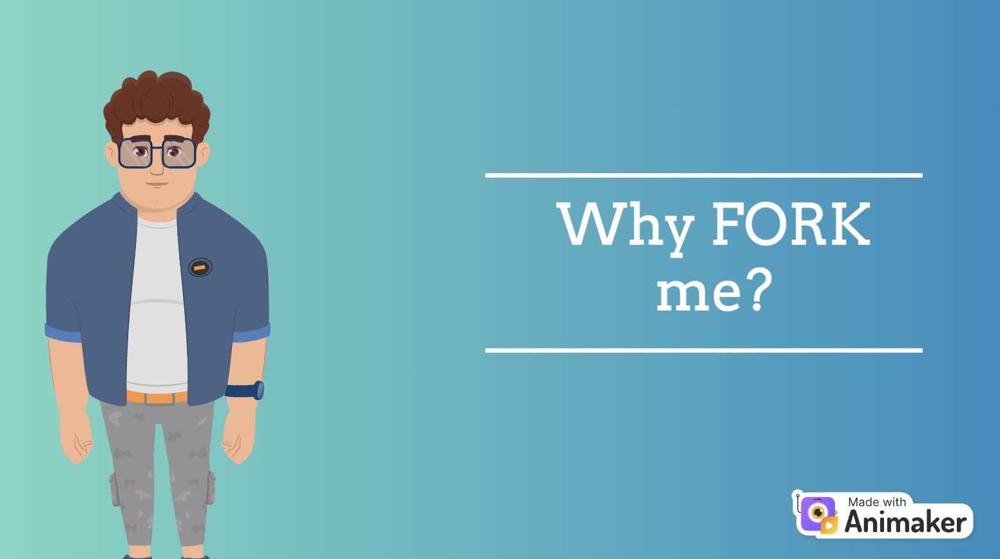

<!--  -->

<p align="center">
  
</p>

## Discord channel link - [](https://discord.gg/ANGKkKvmWH)

[](https://github.com/jayrajmulani/group2-se-homeworks/blob/main/LICENSE)

[](https://zenodo.org/badge/latestdoi/527647386)
[](https://app.travis-ci.com/github/jayrajmulani/group1-se-homeworks/pull_requests)
[](https://github.com/jayrajmulani/edu-setu/graphs/contributors)

---

## Table of Contents

- [About](#about)
- [Getting started](#getting-started)
- [Documentation](#documentation)
- [Development Specifications](#development-specifications)
  - [Backend](./code/backend/README.md)
  - [Frontend](./code/ui/README.md)
- Features Overview
- [License](#license)
- [Future Scope](#future-scope)
- [Contributors](#contributors)

---

<a href="https://app.animaker.com/animo/xJq8qgUlHE0MX9wp/"><h2>Intro Video</h2></a>

<p align="center">
  <a href="https://app.animaker.com/animo/xJq8qgUlHE0MX9wp/"></a>
</p>

---

## About

"Setu" literally translates to "Bridge" in Hindi.

Our project, Edu-Setu, as the name suggests, is a portal that bridges opportunities and can be immensely helpful in the education domain. We all know how cumbersome it can be to manage emails, segregate the important ones and keeping track of the _Loooooooonnngggggg_ mail chains. Opportunities get buried under these tons and tons of emails.

You might be wondering "what" opportunities exactly? Well, the one that every studnet desires to have and every professor usually need to offer! Yes, Edu-Setu facilitates professors to post opportunities for students which may include, but not liimited to:

- Research Opportunities
- Part time roles (On Campus)
- Project Opportunities
- Volunteering Opportunities

And, as you might have guessed, students can come in to apply and connect with the professors via this portal. Edu-Setu keeps the track of all the postings and applications, removing the hassle of "emailing" the professor and waiting for the opportunities to get buried.

---

## Getting Started

Like any web application, this project consists of 3 major components. Frontend, Backend and Database.
We have already deployed the backend on Oracle Cloud Infrastructure. So, that includes the _complicated_ Database configuration setup. All you need to do to start using this project is to setup the User Interface. Unfortunately, we couldn't deploy the frontend on the server because of memory limitations on the free-tier account. So, we have the next-best thing in place! Yes, using DOCKER, which means you don't even have to clone the git repo!

Follow the below steps to get started:

1. [Install docker](https://docs.docker.com/get-docker/), if it's not already installed in your system!
2. Start Docker Desktop and run the container using the below command - Yes, just one command...

```
docker run -it -d -p 3000:3000 jayrajmulani/edusetu_ui
```

3. Navigate to [localhost:3000](http://localhost:3000) to your browser.
4. Hit register to create your account
5. Login to begin bridging opportunities!

---

## Documentation

<br/>

### Development Specifications


The portal is developed with the above mentioned tech-stack. Detailed documentation for each component can be found as below:

1. [Backend](./code/backend/README.md)
2. [Frontend](./code/ui/README.md)

## License

This project is licensed under [MIT](https://mit-license.org/).

Further details regarding the license can be found [here](https://github.com/jayrajmulani/group1-se-homeworks/blob/main/LICENSE).

## Future scope

- Provide push notifications to students when there is an update to their current application status and to professors when a student applies for a job posting.
- Provide interview zoom schedule links right from the portal to the applicants if selected for an interview, also provide a button to students to show if they can attend the meeting on the provided scheduled date or would like to request another date.
- Include a referral feature that will allow hired candidates to provide a referral to other suitable students for other positions available under the professor they work for.
- Provide a page to assign weekly shifts for hired students as per their available timeframe.
- Scale up the project by using cloud storage to store other important features like resumes, cover letters, and internship certificates of students so the professor can make a better decision on who to shortlist for interview.
- Validate whether an email is an Edu mail (can also validate it for specific college edu mail as only students from that college should be allowed to apply for college specific positions) or not, also provide an OTP mechanism so that only authentic users can register.
- Provide a feature so that students or professors who have worked together on a project can endorse each other's skills (Like Linkedin).
- Once logged in maintain the status as logged in for a particular device until the user signs out to provide more convenience to the user.


<a href="https://app.animaker.com/animo/xJq8qgUlHE0MX9wp/"><h2>Why FORK our project</h2></a>

<p align="center">
  <a href="https://app.animaker.com/animo/U8kmFueXtw7EeXdL/"></a>
</p>

## Contributors

- [Jayraj Mulani](https://github.com/jayrajmulani)
- [Yashasya Shah](https://github.com/Yashasya)
- [Harshil Sanghvi](https://github.com/Harshil47)
- [Dhrumil Shah](https://github.com/Dhrumil0310)
- [Anisha Chazhoor](https://github.com/anishasc99)
