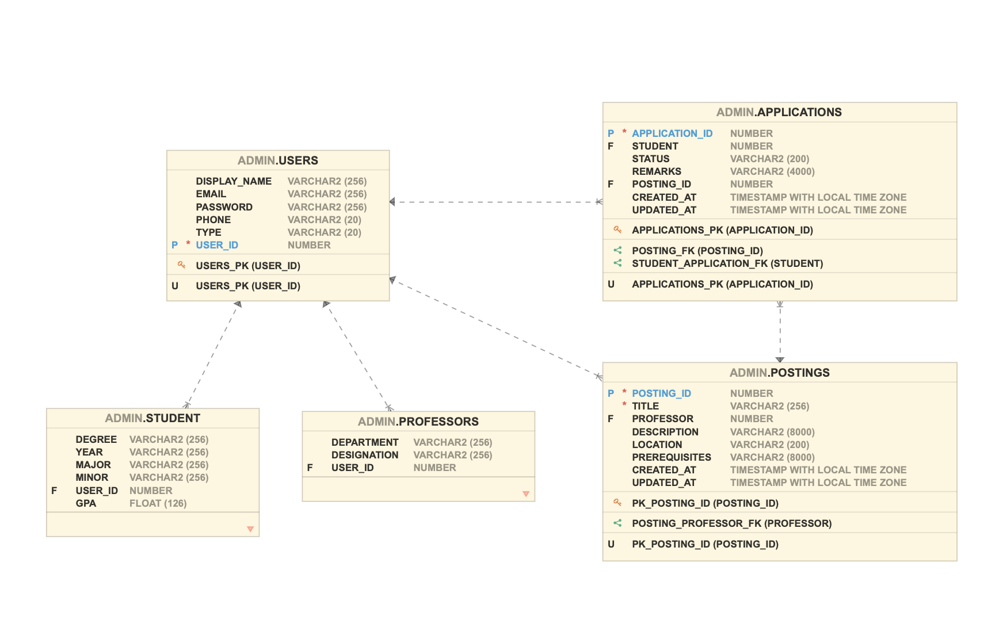

# Development Specifications

## Backend

### Relational Diagram


<!--  -->

### API Endpoints

```
/login [POST]
Request:
{
    email : string,
    password: string
}
Response:
{
    status: boolean,

    if status is True:
        data:{
            email: string,
            user_id: number,
            display_name: string
            type: string (Professor / Student)
        }
    else:
        data: string (containing an error message)
}
```

---

```
/register [POST]
Request:
{
    email : string,
    password: string,
    display_name: string,
    type: string (Professor / Student),
    phone: string,
    if type == "Student":
        gpa: float,
        major: string,
        minor: string,
        degree: string,
        year: string
    elif type == "Professor":
        department: string,
        designation
}
Response:
{
    status: boolean
    if status is True:
        data:{
            email: string,
            user_id: number,
            display_name: string
            type: string (Professor / Student)
        }
    else:
        data: string (containing an error message)
}
```

---

```

/get_all_users [GET]
Request: N/A
Response:
{
    status: boolean,

    if status is True:
        data:{
            email: string,
            user_id: number,
			phone: number,
            display_name: string
            type: string (Professor / Student)
        }
    else:
        data: string (containing an error message)
}
```

---

```

/get_all_applications_by_student [POST]
Request:
{
    email : string,
    password: string
}
Response:
{
	status: boolean,

	if status is True:
		data:
		[
			{
				application_id: number,
				posting_id: number,
				title: string,
				description: string,
				location: string,
				prerequisites: string,
				created_at: string, (of the application, NOT the posting)
				updated_at: string, (of the application, NOT the posting)
				professor_user_id: number,
				professor_email: string,
				professor_department: string,
				professor_designation: string
				professor_display_name: string,
				student_user_id: number,
				student_display_name: string,
				student_email: string,
				student_phone: string,
				student_gpa: float,
				student_major: string,
				student_minor: string,
				student_year: string,
				status: string // This is the status of the application and NOT the response.
				remarks: string
			}
		]
	else:
	data: string (error message)
}

```

---

```

/get_specific_application [POST]

Request:
{
	application_id: number,
}
Response:
{

	status: boolean
	data: {
		student: number,
		remarks: string,
		posting_id: number,
		status: string (By default it will be Pending)
		created_at: string,
		updated_at: string

}

```

---

```

/get_all_postings_by_professor [POST]
Request:
{

    student: number (user id of student),

}
Response:
{
    status: boolean
    data:
	{
		posting_id: number,
		title: string,
		professor: number (user id of professor)
		description: string,
    	location: string,
   		prerequisites: string,
		created_at: string,
		updated_at: string
	}
}

```

---

```

/delete_posting [POST]
Request:
{
    posting_id : number ,
}
Response:
{
    status: boolean,
    data: message (Success / Error message as per status)
}

```

---

```

/add_posting [POST]
Request:
{
    title: string,
    professor: number (user id of professor),
    description: string,
    location: string,
    prerequisites: string
}
Response:
{
    status: boolean
    data: message (Success / Error message as per status)
    // CREATED_AT and UPDATED_AT timestamps to be appropriately set by the API
}
```

---

```
/get_all_postings [GET]
Request: N/A
Response:
{
	status: boolean,

	if status is True:
		data:
		[
			{
				posting_id: number,
				title: string,
				description: string,
				professor_email: string,
				professor_department: string,
				professor_designation: string
				professor_display_name: string,
				location: string,
				prerequisites: string,
				created_at: string,
				updated_at: string
			}
		]
	else:
	data: string (error message)
}
```

---

```
/get_all_application [GET]
Request: N/A
Response:
{
	status: boolean,

	if status is True:
		data:
		[
			{
				application_id: number,
				posting_id: number,
				title: string,
				description: string,
				location: string,
				prerequisites: string,
				created_at: string, (of the application, NOT the posting)
				updated_at: string, (of the application, NOT the posting)
				professor_user_id: number,
				professor_email: string,
				professor_department: string,
				professor_designation: string
				professor_display_name: string,
				student_user_id: number,
				student_display_name: string,
				student_email: string,
				student_phone: string,
				student_gpa: float,
				student_major: string,
				student_minor: string,
				student_year: string,
				status: string // This is the status of the application and NOT the response.
				remarks: string
			}
		]
	else:
	data: string (error message)
}

```

---

```
/update_posting [POST]
Request:
{
	posting_id: number,
	title: string,
	description: string,
	location: string,
	prerequisites: string,
}
Response:
{
	status: boolean
	data: (Success / Error message as per status)
	// UPDATED_AT timestamp should be auto updated by the API
}
```

---

```
/update_application [POST]
Request:
{
	application_id: number,
	status: string (This should be overwritten in the DB by API),
  remarks: string
}
Response:
{
	status: boolean
	data: (Success / Error message as per status)
	// UPDATED_AT timestamp should be auto updated by the API
}

```

---

```
/edit_profile
Request:
{
	user_id: number,
	email : string,
	password: string,
	display_name: string,
	type: string (Professor / Student),
	phone: string,
	if type == "Student":
		gpa: float,
		major: string,
		minor: string,
		degree: string,
		year: string
	elif type == "Professor":
		department: string,
		designation
}
Response:
{
	status: boolean
	data: (Success / Error message as per status)
}
```

---

```
/get_user_profile [POST]
Request:
{
	user_id: number
}
Response:
{
	status: boolean,
	data:
	{
		user_id: number,
		display_name: string,
		email: string,
		phone: string,
		type: string,
		if type == "Student":
			gpa: float,
			major: string,
			minor: string,
			degree: string,
			year: string
		elif type == "Professor":
			department: string,
			designation: string
	}

}
```

---

```
/add_application
Request:
{
	student: number,
	remarks: string,
	posting_id: number,
	status: string (By default it will be Pending)
}
Response:
{
	status: boolean
	data: message (Success / Error message as per status)
	// CREATED_AT and UPDATED_AT timestamps to be appropriately set by the API
}

```

---

```
/get_applications_for_professor [POST]
Request:
{
	professor: number
}
Response:
{
	status: boolean
	data:
	[
		{
			professor: number
			position_id: number,
			title: string,
			description: string,
			prerequisites: string,
			applications: // A list of all the applications for this position_id
			[
				{
					application_id: number
					student_user_id: number,
					student_display_name: string,
					student_email: string,
					student_phone: string,
					student_gpa: float,
					student_major: string,
					student_minor: string,
					student_year: string,
					status: string // This is the status of the application and NOT the response.
					remarks: string

				}
			]
		}
	]
}
```
