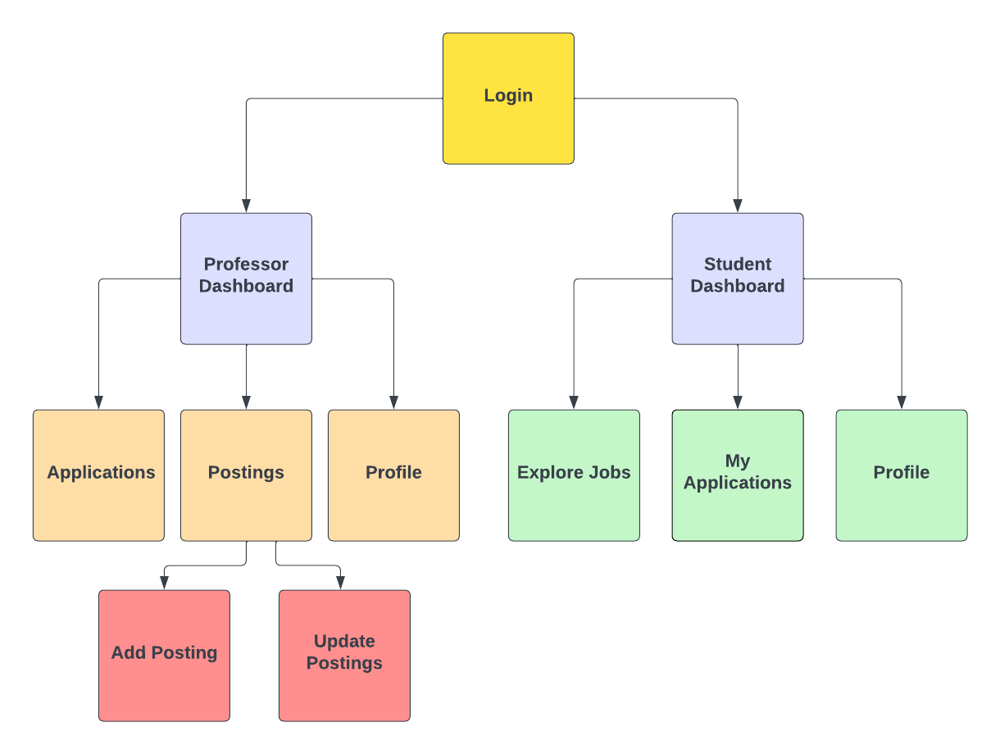

# Component Hierarchy

# Directory Structure

<pre>
. 
├── package-lock.json
├── package.json
├── public
│   ├── assets
│   │   └── images
│   │       ├── Edu_Setu_Logo_Transparent.png
│   │       └── main-logo.jpeg
│   ├── favicon.ico
│   ├── index.html
│   ├── manifest.json
│   └── robots.txt
└── src
    ├── App.css
    ├── App.js
    ├── App.test.js
    ├── Components
    │   ├── Home
    │   │   ├── Home.css
    │   │   ├── Home.js
    │   │   └── NotFound.js
    │   ├── Login
    │   │   ├── Login.css
    │   │   └── Login.js
    │   ├── ProfessorDashboard
    │   │   ├── AddNewPosting.js
    │   │   ├── Applications.js
    │   │   ├── Postings.js
    │   │   ├── Profile.js
    │   │   ├── UpdateApplication.js
    │   │   └── UpdatePosting.js
    │   ├── __tests__
    │   └── studentdashboard
    │       ├── applications.json
    │       ├── index.jsx
    │       ├── jobs.json
    │       ├── navbar
    │       │   ├── index.css
    │       │   └── index.jsx
    │       ├── savedapplication.jsx
    │       ├── studentDashboard.css
    │       ├── studentProfile.css
    │       ├── studentProfile.jsx
    │       ├── studentdashboard.jsx
    │       ├── trackapplication.jsx
    │       └── user.json
    ├── Redirections.js
    ├── assets
    │   └── logo.png
    ├── config.js
    ├── index.css
    ├── index.js
    ├── logo.svg
    ├── reportWebVitals.js
    └── setupTests.js
</pre>